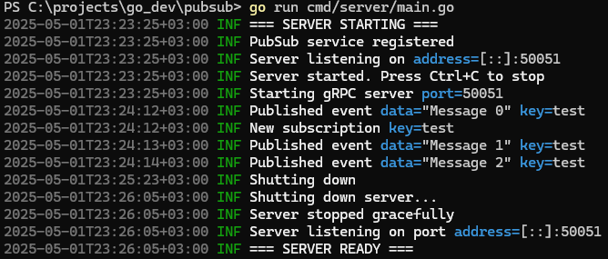
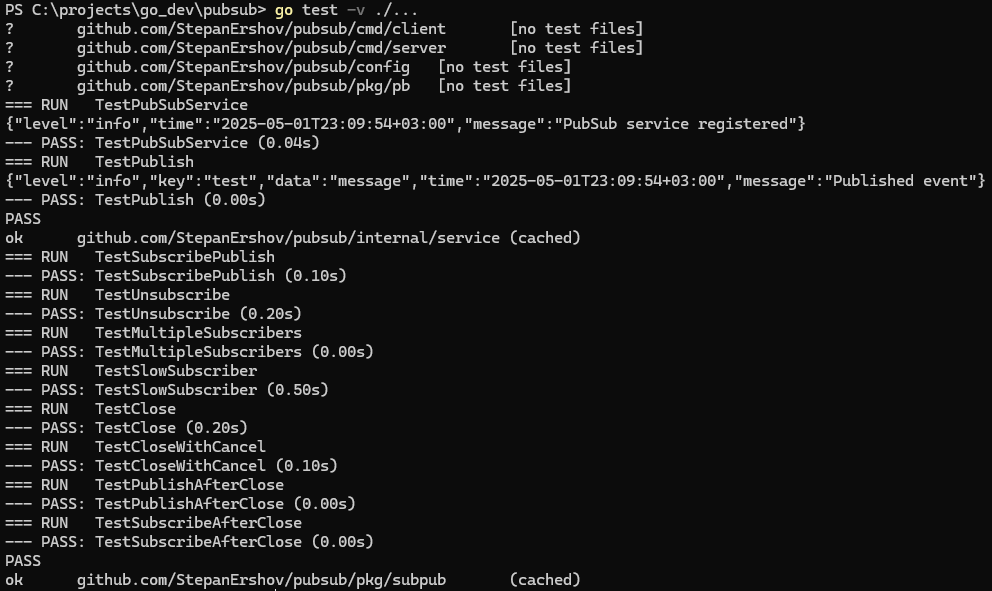

# PubSub Service

Реализация сервиса подписки и публикации событий на основе gRPC с внутренней шиной событий.

## Архитектура

Проект состоит из двух основных компонентов:
1. `pkg/subpub` - внутренняя реализация шины событий (Publisher-Subscriber)
2. `internal/service` - gRPC сервис, использующий шину событий
  ```
  +----------------+       +---------------+       +----------------+
| gRPC Server    | <---> | PubSubService | <---> | subpub.Bus     |
+----------------+       +---------------+       +----------------+
  ```

## Особенности реализации

- **Шина событий**:
  - Поддержка множества подписчиков на один subject
  - Асинхронная доставка сообщений (медленные подписчики не блокируют других)
  - Гарантированный порядок сообщений (FIFO)
  - Graceful shutdown с учетом контекста
  - Отсутствие утечек горутин

- **gRPC сервис**:
  - Подписка на события по ключу (streaming)
  - Публикация событий по ключу
  - Правильные gRPC статусы ошибок
  - Graceful shutdown
  - Конфигурирование через YAML

## Структура проекта

```plaintext
.
├── cmd/ # Клиент и сервер
├── config/ # Конфигурация
├── internal/ # Внутренние компоненты
│ └── service/ # gRPC сервис
├── pkg/ # Переиспользуемые пакеты
│ ├── pb/ # Сгенерированный gRPC код
│ └── subpub/ # Реализация шины событий
└── proto/ # Protobuf схемы
```
## Запуск сервиса

### Требования

- Go 1.20+
- protoc (для перегенерации proto-файлов)

### Конфигурация

Пример `config.yaml`:
```yaml
server:
  address: ":50051"
  shutdown_timeout: 10s
```

### Сборка и запуск

- Установите зависимости:
  ```bash
  go mod download
  ```
- Сгенерируйте gRPC код (если меняли proto-файлы):
  ```bash
  buf generate
  ```
- Запустите сервер:
  ```bash
  go run cmd/server/main.go
  ```
- Запустите клиент (в другом терминале):
  ```bash
  go run cmd/client/main.go
  ```

## API
### gRPC методы
  - `Subscribe(SubscribeRequest) returns (stream Event)` - подписка на события по ключу
  - `Publish(PublishRequest) returns (Empty)` - публикация события по ключу
### Использованные паттерны
  1. Dependency Injection:
  - PubSubService принимает subpub.Bus через конструктор
  - Позволяет легко тестировать и заменять реализации
  2. Graceful Shutdown:
  - Сервер корректно обрабатывает сигналы завершения
  - Дает время на завершение активных соединений
  - Принудительно завершает работу по таймауту
  3. Observer/Publisher-Subscriber:
  - Основной паттерн, реализованный через subpub
  4. Server-Side Streaming:
  - Для реализации подписки на события

### Пример использования
  ```go
stream, err := client.Subscribe(ctx, &pb.SubscribeRequest{Key: "test"})
for {
    event, err := stream.Recv()
}

_, err := client.Publish(ctx, &pb.PublishRequest{
    Key: "test",
    Data: "message",
})
  ```
### Тестирование
#### Запуск unit-тестов:
  ```bash
  go test ./...
  ```
Тесты покрывают:
- Шину событий (subpub)
- gRPC сервис

## Логирование
Используется структурированное логирование с полями:
- Временная метка
- Уровень логирования
- Сообщение
- Контекстные поля

## Визуализация работы системы

<div style="display: flex; justify-content: space-between;"> 
   
   
</div>


